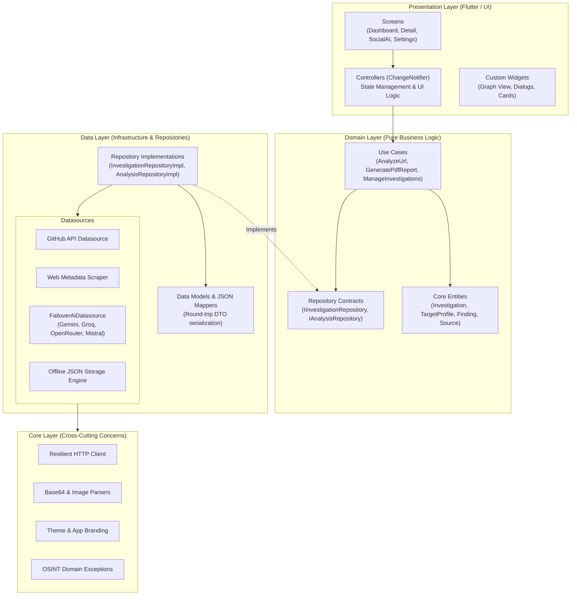
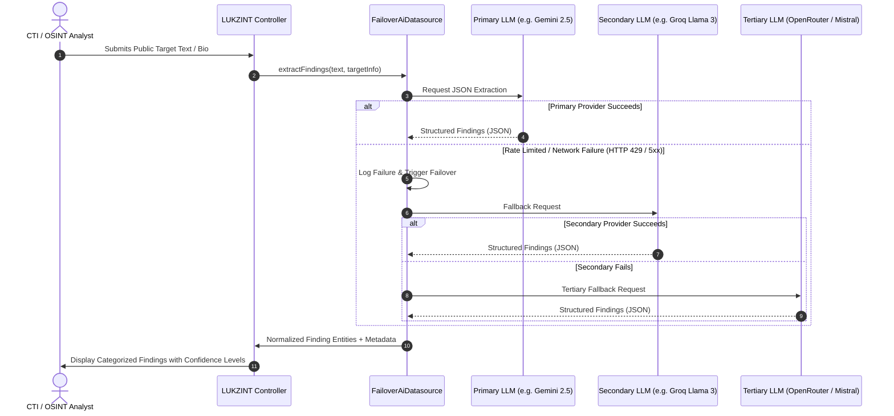

# 🛡️ LUKZINT — OSINT Social Analyzer & Cyber-Intelligence Platform

<div align="center">

[](https://github.com/lukgutierrez/lukzint-osint)
[](https://github.com/lukgutierrez/lukzint-osint)
[](https://github.com/lukgutierrez/lukzint-osint)
[](https://github.com/lukgutierrez/lukzint-osint)
[](LICENSE)

**An enterprise-grade, offline-first Open Source Intelligence (OSINT) and Social Network Analysis platform built with Flutter & Dart.**  
Engineered for digital forensic examiners, cyber threat intelligence (CTI) analysts, and investigative researchers to discover, correlate, and generate court-ready intelligence dossiers with multi-provider AI failover resiliency.

Developed by **Luciano Gutierrez** ([@lukgtz](https://github.com/lukgutierrez)) — *Software Engineer & OSINT Researcher*.

[📥 Download APK (v1.0.0)](#-download--installation) • [🏛️ Architecture](#-software-architecture--engineering-design) • [🧠 AI Engine](#-multi-provider-ai-failover-engine) • [💼 Use Cases](#-real-world-use-cases) • [🧪 Testing](#-testing--quality-assurance) • [📬 Contact](#-author--contact)

</div>

---

## 📱 Visual Overview

<div align="center">
  <table>
    <tr>
      <td align="center"><b>Investigation Command Center</b></td>
      <td align="center"><b>AI-Assisted Intelligence Extraction</b></td>
      <td align="center"><b>Court-Ready Forensic PDF Report</b></td>
    </tr>
    <tr>
      <td></td>
      <td></td>
      <td></td>
    </tr>
  </table>
</div>

---

## 📥 Download & Installation

### Option 1: Direct Android APK (Release v1.0.0)
You can directly test and install the production APK on any Android device:

1. **Download the APK:** Download [`releases/lukzint-v1.0.0.apk`](https://github.com/lukgutierrez/lukzint-osint/raw/main/releases/lukzint-v1.0.0.apk) from this repository.
2. **Transfer / Open on Android:** Open the `.apk` file on your Android smartphone or tablet.
3. **Allow Installation:** Enable *"Install from Unknown Sources"* in your security settings when prompted.
4. **Launch:** Enjoy the native offline-first OSINT workspace with the custom cyber-intelligence launcher icon and animated splash screen.

### Option 2: Build from Source
```bash
# Clone repository
git clone https://github.com/lukgutierrez/lukzint-osint.git
cd lukzint-osint

# Install dependencies
flutter pub get

# Run static analysis and automated test suite
flutter analyze
flutter test

# Run on your connected device or desktop
flutter run
```

---

## 🎯 Executive Summary & Mission

Modern cyber investigations and OSINT workflows often suffer from fragmented notes, ephemeral social links, unverified data dumps, and fragile evidence preservation.

**LUKZINT** solves this by enforcing a strict **Digital Chain of Custody**:
* **Every Finding is Immutable & Traceable:** Every insight is cryptographically tied to its originating URL/Source.
* **100% Offline-First Privacy:** Investigations and entity graphs are persisted locally on-device in structured JSON stores—no third-party cloud data harvesting.
* **Passive & Non-Intrusive Intelligence:** Operates strictly over publicly available records, open endpoints, and authorized metadata.

---

## 🏛️ Software Architecture & Engineering Design

LUKZINT is designed following **Clean Architecture** and **Domain-Driven Design (DDD)** principles to guarantee testability, maintainability, and total independence from UI frameworks and external API providers.



### Architectural Principles Applied:
1. **Separation of Concerns:** Zero business logic in widgets; all mutations pass through granular Use Cases.
2. **Dependency Inversion Principle (DIP):** Domain layer defines interfaces; Data layer fulfills them.
3. **Fail-Safe Redundancy:** Automatic multi-provider LLM cascade ensuring continuous intelligence extraction even during rate-limits or outages.
4. **Supply Chain Security:** Zero bloat—relies on native Dart/Flutter core capabilities with minimal trusted dependencies.

---

## 🧠 Multi-Provider AI Failover Engine

LUKZINT features an enterprise-grade AI extraction pipeline with **automatic cascading failover**:



---

## 💼 Real-World Use Cases

### 1. Cyber Threat Intelligence (CTI) & Threat Actor Profiling
* **Scenario:** Profiling suspected threat actors or exposed contributor footprints.
* **Capabilities:** Automated extraction of developer emails from commit history, identification of leaked repository secrets, and mapping of pseudonym aliases across online handles.

### 2. Executive Exposure & Due Diligence (Anti-Spear Phishing)
* **Scenario:** Assessing C-level digital footprints to mitigate targeted social engineering and business email compromise (BEC).
* **Capabilities:** Auditing publicly indexed personal emails, affiliations, family mentions, and technical routines.

### 3. Digital Forensics & Law Enforcement Support
* **Scenario:** Gathering public open-source corroborating evidence for judicial filings.
* **Capabilities:** Exporting standardized forensic PDF reports containing exact timestamped source URLs, evidentiary quotes, and relationship mapping with zero manual editing errors.

---

## 🔍 Core Feature Matrix

| Module | Technical Capability | Forensic Value |
| :--- | :--- | :--- |
| **Dossier Management** | Multi-case tracking with state machines (`Draft`, `In Progress`, `Completed`). | Enforces audit trails with creation and last-modified metadata. |
| **Target Profiling** | Full identity indexing (Aliases, IDs, Locations, Roles, Local Base64 Avatar). | Centralized target nexus for multi-source correlation. |
| **GitHub Intelligence** | Direct REST integration extracting repos, bio, company, location, and social links. | Passive technical fingerprinting without authentication tokens required. |
| **Web Metadata Harvester** | OpenGraph, schema tags, headers, and semantic text extraction. | Fast triage of corporate websites, portfolio pages, and public blogs. |
| **AI Extraction Engine** | Structured NLP parser with strict JSON protocol & confidence scoring (`Low`, `Medium`, `High`). | Converts unstructured OSINT text dumps into actionable categorized findings. |
| **Multi-Tier Relationship Graph**| Multigenerational link classification (`Parents`, `Spouses`, `Colleagues`, `Children`). | Maps social exposure vectors and intermediary link nodes. |
| **Forensic PDF Generator** | Automated vector PDF layout with clickable sources and evidence blocks. | Immediate executive and courtroom deliverable generation. |
| **Local Encrypted Storage** | Isolated sandbox filesystem storage utilizing `path_provider`. | Zero cloud exposure; data remains strictly confidential on analyst hardware. |

---

## 🧪 Testing & Quality Assurance

LUKZINT is built with a **Test-Driven & Quality-First mindset**. Every layer has automated verification:

```bash
# Execute test suite
flutter test

# Run static linter
flutter analyze
```

### Coverage Highlights:
* **Unit Tests:** Serialization round-trips for all Domain and Data models (`FindingModel`, `SourceModel`, `TargetProfileModel`, `InvestigationModel`).
* **Resilience Tests:** Verified AI failover switching when primary API keys fail or return malformed outputs.
* **PDF Verification:** Generation validated across empty dossiers, partial profiles, and large base64 avatar graphs.
* **Responsive UI Verification:** Tested across compact mobile viewports (320px) to ultra-wide desktop monitors without RenderFlex overflow.

---

## ⚖️ Legal, Ethical & Compliance Framework

LUKZINT is engineered strictly for **defensive cyber-intelligence, authorized due diligence, and lawful research**:

* **Passive Reconnaissance Only:** No port scanning, brute-forcing, credential stuffing, or vulnerability exploitation modules.
* **No Authentication Bypass:** Strictly queries publicly accessible endpoints and user-supplied data.
* **Ethical Scraping:** Complies with HTTP best practices and respect for remote endpoint rate limits.
* **Compliance Ready:** Designed to assist organizations adhering to GDPR, CCPA, and international data governance frameworks.

---

## 🗺️ Project Roadmap

- [x] **v1.0.0 Core Platform:** Complete dossier management, GitHub API, Web Scraper, AI Failover Engine, PDF Export, and Android Release.
- [ ] **Interactive HTML Reports:** Self-contained, offline interactive HTML report exports.
- [ ] **Dynamic Graph Visualizer:** Real-time force-directed node graph for visual link exploration.
- [ ] **Wayback Machine Integration:** Automated archival checks via Internet Archive API for dead links.
- [ ] **Local AES-256 Database Encryption:** At-rest encryption for sensitive investigation files.
- [ ] **Exportable Cryptographic Bundles:** Signed `.lukzint` archive packages for secure peer-to-peer analyst exchange.

---

## 👨‍💻 Author & Contact

<div align="center">

### **Luciano Gutierrez**
*Software Engineer & OSINT Researcher*  
Handle: **`@lukgtz`**

[](https://www.linkedin.com/in/lucianogutierrezlgtz/)
[](https://github.com/lukgutierrez/lukzint-osint)
[](mailto:lucianogutierrezlgtz@gmail.com)

</div>

---

<div align="center">
  <sub>Built with engineering precision and dedication to ethical cyber intelligence.</sub>
</div>
