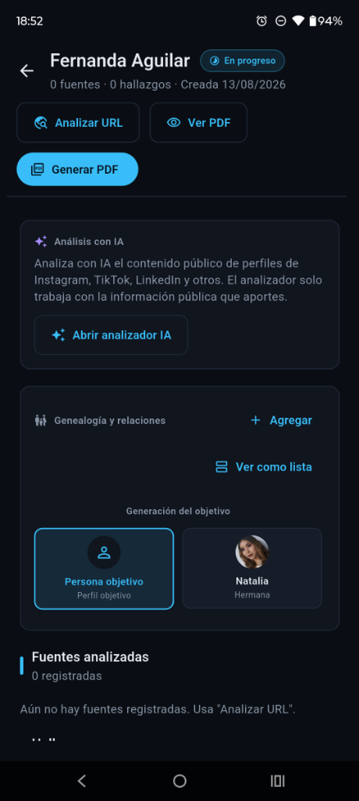
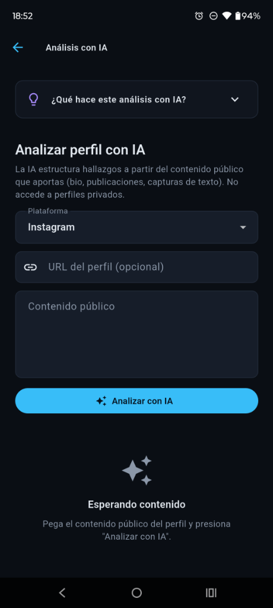
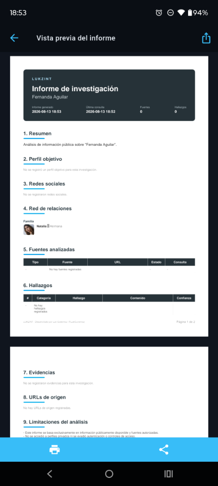

# LUKZINT — OSINT Social Analyzer

> **Plataforma Profesional de Inteligencia de Fuentes Abiertas (OSINT)** diseñada bajo principios de arquitectura limpia, con análisis asistido por IA multi-proveedor (con redundancia automática) y generación de informes de nivel judicial/corporativo con preservación rigurosa de evidencias.

Desarrollado por **Luk Gutierrez** (`@LukGutierrez`) — Ingeniería de Software y Recolección de Inteligencia.

---

## Vista Previa de la Aplicación

### 1. Panel de Control de la Investigación
El centro de mando de cada expediente, donde se gestionan las fuentes, la red de relaciones por nivel generacional y las acciones de análisis.



### 2. Módulo de Análisis con IA
Estructura hallazgos desde texto público aportado (biografías, publicaciones, metadatos) asociándoles categoría, nivel de confianza y evidencia.



### 3. Informe PDF de Inteligencia Generado
Reporte estructurado final de nivel profesional/judicial con la cadena de fuentes, hallazgos, red de relaciones y limitaciones legales.



---

## Tabla de Contenidos

1. [¿Qué es LUKZINT?](#qué-es-lukzint)
2. [Usuarios Objetivo (¿Quiénes lo pueden usar?)](#usuarios-objetivo-quiénes-lo-pueden-usar)
3. [Casos de Uso Avanzados](#casos-de-uso-avanzados)
4. [Características Principales](#características-principales)
5. [Modelo y Arquitectura (Ingeniería de Software)](#modelo-y-arquitectura-ingeniería-de-software)
6. [Stack Tecnológico](#stack-tecnológico)
7. [Estructura del Proyecto](#estructura-del-proyecto)
8. [Instalación y Puesta en Marcha](#instalación-y-puesta-en-marcha)
9. [Configuración del Análisis con IA](#configuración-del-análisis-con-ia)
10. [Ética, Cumplimiento y Marco Legal](#ética-cumplimiento-y-marco-legal)
11. [Testing y Calidad del Software](#testing-y-calidad-del-software)
12. [Roadmap](#roadmap)

---

## ¿Qué es LUKZINT?

**LUKZINT** es una aplicación de escritorio y móvil concebida para estructurar, auditar y documentar investigaciones digitales a partir de información de acceso público en Internet. 

En lugar de depender de notas desorganizadas y capturas de pantalla aisladas, LUKZINT proporciona un **entorno unificado de trabajo offline-first** donde los datos se estructuran siguiendo una cadena de custodia digital: cada hallazgo (Finding) se asocia directamente a una fuente verificable (Source), garantizando la reproducibilidad y el rigor metodológico de la investigación.

---

## Usuarios Objetivo (¿Quiénes lo pueden usar?)

* **Investigadores OSINT y Analistas de Inteligencia:** Profesionales que necesitan recopilar información de objetivos, estructurar evidencias cruzadas y exportar informes listos para presentación legal, judicial o corporativa.
* **Periodistas de Investigación:** Herramienta clave para verificar identidades, rastrear conexiones de red de personajes de interés público y almacenar el histórico de fuentes digitales antes de su eventual borrado.
* **Analistas de Ciberseguridad y CTI (Cyber Threat Intelligence):** Ideal para perfilar actores de amenazas, identificar vectores de ataque pasivos expuestos en la web pública (ej. repositorios con secretos expuestos) y documentar su huella digital.
* **Auditores de Privacidad y Oficiales de Cumplimiento (Corporate Due Diligence):** Herramienta para evaluar el nivel de exposición pública de directivos de una empresa (mitigando riesgos de ingeniería social / Spear Phishing) o validar antecedentes de socios comerciales sobre fuentes públicas.

---

## Casos de Uso Avanzados

### Caso de Uso 1: Auditoría de Exposición de Información (Executive Profiling)
* **Objetivo:** Determinar qué datos sensibles de un directivo están expuestos públicamente en internet para entrenar campañas de concienciación sobre phishing.
* **Flujo de Trabajo:**
  1. El auditor crea una investigación llamada *"Auditoría de Exposición - CEO"*.
  2. Utiliza el **Analizador de URLs** para escanear el sitio web corporativo y su perfil de GitHub público.
  3. El sistema extrae metadatos clave (correos electrónicos declarados en commits, claves expuestas, servidores referenciados).
  4. Utiliza el **Análisis con IA** ingresando textos públicos extraídos de blogs o discursos para detectar menciones de tecnologías internas o rutinas de trabajo.
  5. Mapea la **Red de Relaciones** del directivo para determinar si sus familiares directos exponen indirectamente información laboral.
  6. Exporta el **Informe PDF** final con las advertencias y limitaciones pertinentes.

### Caso de Uso 2: Debida Diligencia Corporativa (Due Diligence)
* **Objetivo:** Verificar la trayectoria pública e historial técnico de un proveedor o candidato técnico antes de otorgarle acceso a sistemas críticos.
* **Flujo de Trabajo:**
  1. Se crea la investigación de debida diligencia.
  2. Se introduce el perfil de GitHub del candidato.
  3. La app analiza automáticamente a través de la API oficial el historial del usuario, repositorios públicos y metadatos de aportaciones para verificar la autenticidad y antigüedad de su portafolio.
  4. Los hallazgos se guardan de forma inmutable asociados a las URLs originales de GitHub.

### Caso de Uso 3: Análisis de Vínculos y Redes Sociales (Social Network Analysis)
* **Objetivo:** Reconstruir la red de conexiones cercanas de un perfil investigado basándose estrictamente en interacciones o menciones públicas de familiares y colaboradores.
* **Flujo de Trabajo:**
  1. Se definen las características del **Perfil Objetivo** (alias, cargo, foto).
  2. Se añaden las personas de su entorno indicando el tipo de vínculo (`brother`, `spouse`, `colleague`, etc.).
  3. El sistema categoriza las relaciones en base a su jerarquía generacional (`generation`).
  4. El analista visualiza la red organizada por generaciones para identificar intermediarios o perfiles alternativos que pudieran estar filtrando información relevante.

---

## Características Principales

| Módulo | Descripción Técnica | Implementación en LUKZINT |
| --- | --- | --- |
| **Gestión de Expedientes** | Estructuración de investigaciones con metadatos de auditoría. | Estados: Borrador, En progreso y Completada. Control de fechas de creación y actualización. |
| **Perfil Objetivo** | Consolidación de datos principales de la persona o entidad bajo estudio. | Nombre completo, DNI/ID, alias, ubicación, ocupación, notas estructuradas y almacenamiento de fotografía. |
| **Scraping y Consumo de APIs** | Extracción automatizada de información de fuentes web públicas. | Conexión directa a la API oficial de **GitHub** y parser genérico de metadatos HTML (OpenGraph, Headers) sin intermediarios. |
| **Análisis de Contenido con IA** | Procesamiento de lenguaje natural sobre biografías, publicaciones y textos públicos. | Extracción automatizada de hallazgos estructurados (categoría, descripción, confianza y evidencia textual). |
| **Redundancia de IA (Failover)** | Tolerancia a fallas y resiliencia en la disponibilidad de APIs de LLMs. | Sistema multi-proveedor (**Gemini, OpenRouter, Groq, Mistral**) con cascada de fallback automático ante caídas o límites excedidos. |
| **Mapeo de Relaciones** | Registro estructurado de la red social inmediata (genealogía, amigos, colegas). | Clasificación por grupos y generaciones relativas al objetivo. Fotos almacenadas de forma local en formato base64. |
| **Generación de Entregables** | Creación de informes ejecutivos profesionales listos para auditorías externas. | Motor de reporte PDF integrado. Preserva inalteradas las fuentes originales de información y las limitaciones del análisis. |
| **Seguridad de Datos** | Almacenamiento local seguro de la base de conocimiento de la investigación. | Base de datos offline-first en archivos JSON. Ningún dato de las investigaciones se transmite a servidores de terceros (excepto llamadas directas a las APIs de IA / Scraping). |

---

## Modelo y Arquitectura (Ingeniería de Software)

LUKZINT está construido bajo los lineamientos de **Clean Architecture (Arquitectura Limpia)**, garantizando que el núcleo de negocio sea independiente de las interfaces de usuario, bases de datos y servicios externos.

```
┌──────────────── Presentation Layer ────────────────┐
│  Screens · Widgets · Controllers (ChangeNotifier)  │
└─────────────────────────┬──────────────────────────┘
                          │ Utiliza
┌──────────────────── Domain Layer ──────────────────┐
│  Entities · Repositories (Contracts) · Usecases   │
└─────────────────────────┬──────────────────────────┘
                          │ Implementa / Extiende
┌────────────────────── Data Layer ──────────────────┐
│  Models · Repositories Impl · Datasources (APIs,  │
│  WebScraper, JSON Storage)                         │
└─────────────────────────┬──────────────────────────┘
                          │ Soporta a todas las capas
┌────────────────────── Core Layer ──────────────────┐
│  Network Client · Settings · Storage · Theme · Utils│
└────────────────────────────────────────────────────┘
```

### Decisiones de Diseño Arquitectónico (ADRs)
* **ADR-001 — Framework:** Uso exclusivo de **Flutter y Dart** para asegurar portabilidad nativa y rendimiento multiplataforma óptimo con una única base de código.
* **ADR-002 — Arquitectura:** Separación estricta en 4 capas (`Presentation`, `Domain`, `Data`, `Core`). La interfaz de usuario nunca contiene lógica de negocio; esta se delega a los **Casos de Uso** independientes.
* **ADR-003 — Fuentes:** Trabajo limitado de forma estricta a información pública mediante APIs oficiales y mecanismos estándar de scraping, velando por la legalidad de los datos.
* **ADR-004 — Dependencias:** Minimización estricta de librerías externas. La inyección de dependencias se realiza de manera manual en el ensamblaje raíz ([main.dart](file:///c:/Users/LukGutierrez/Desktop/APP%20OSINT/lib/main.dart)) reduciendo vectores de ataque en la cadena de suministro de software.

---

## Stack Tecnológico

* **Framework Base:** Flutter 3.x / Dart 3.x (Versiones estables)
* **Gestión de Estado:** `ChangeNotifier` + Patron Controller con inyección manual de dependencias.
* **Persistencia:** Repositorio JSON local (`JsonStorage` basado en `path_provider`), garantizando privacidad absoluta de las investigaciones.
* **Cliente HTTP:** `HttpNativeClient` propio sobre el cliente nativo de Dart, evitando dependencias externas complejas.
* **Generación de Reportes:** `package:pdf` para la maquetación y generación nativa de documentos y `package:printing` para visualización previa y soporte de impresión.
* **Proveedores de Inteligencia Artificial:** Integración nativa con la API de Google Gemini y clientes compatibles con OpenAI para Groq, OpenRouter y Mistral AI.

---

## Estructura del Proyecto

La estructura de carpetas refleja fielmente la separación de responsabilidades y la arquitectura limpia:

```
lib/
├── core/                  # Componentes transversales del sistema
│   ├── constants/         # Branding y constantes globales
│   ├── errors/            # Manejo unificado de excepciones OSINT/Red
│   ├── network/           # Cliente HTTP nativo optimizado
│   ├── settings/          # Gestión de configuración de proveedores y APIs
│   ├── storage/           # Implementación del almacenamiento en disco (JSON)
│   ├── theme/             # Paleta de diseño (Dark Theme premium)
│   └── utils/             # Funciones de ayuda (Generación de IDs, validadores)
├── domain/                # Núcleo del negocio (Independiente de frameworks)
│   ├── entities/          # Estructuras de datos (Investigation, Source, Finding, etc.)
│   ├── repositories/      # Interfaces de acceso a datos e informes
│   └── usecases/          # Casos de uso de negocio (AnalyzeUrl, GeneratePdf, etc.)
├── data/                  # Implementación de detalles y llamadas externas
│   ├── datasources/       # Clientes de APIs (GitHub, Scraper, Gemini, OpenAI)
│   ├── models/            # DTOs y serialización/deserialización JSON
│   └── repositories/      # Implementaciones concretas de los repositorios del dominio
├── presentation/          # Capa de Interfaz de Usuario
│   ├── controllers/       # Controladores de pantalla mediante ChangeNotifier
│   ├── screens/           # Pantallas de la aplicación (Dashboard, Detail, AI, Settings)
│   └── widgets/           # Componentes UI reutilizables
└── main.dart              # Punto de entrada y ensamblaje (Inyección de dependencias)
```

---

## Instalación y Puesta en Marcha

### Requisitos Previos
* Tener instalado el SDK de Flutter (versión estable).
* Disponer de conexión a internet para el análisis inicial de URLs y el uso de los motores de IA.

### Pasos para Ejecutar en Entorno de Desarrollo
```bash
# 1. Clonar el repositorio del proyecto
git clone <url-del-repositorio>
cd app_osint

# 2. Obtener las dependencias del pubspec
flutter pub get

# 3. Validar el estado del código con el linter y analizador
flutter analyze

# 4. Ejecutar la suite completa de pruebas unitarias
flutter test

# 5. Compilar y lanzar la aplicación (ejemplo en Windows)
flutter run -d windows
```

---

## Configuración del Análisis con IA

Para habilitar la estructuración inteligente de evidencias en la sección **Análisis con IA**, accede a la pantalla de **Ajustes** dentro de la app y configura las claves de los proveedores que desees utilizar:

| Proveedor | Modelo Recomendado | Panel de Control de Claves |
| --- | --- | --- |
| **Google Gemini** | `gemini-2.5-flash` / `gemini-1.5-flash` | [Google AI Studio](https://aistudio.google.com/) |
| **OpenRouter** | Modelos gratuitos (`:free`) | [OpenRouter Keys](https://openrouter.ai/keys) |
| **Groq** | `llama-3.3-70b-versatile` | [Groq Console](https://console.groq.com/keys) |
| **Mistral AI** | `mistral-small-latest` | [Mistral Console](https://console.mistral.ai/) |

### Mecanismo de Tolerancia a Fallos (Failover Logic)
LUKZINT cuenta con un algoritmo de resiliencia automatizado:
1. Envía la solicitud al **proveedor principal** seleccionado.
2. Si la API devuelve un error de cuota excedida, error de red, clave inválida o respuesta mal estructurada, la aplicación intercepta el error.
3. Si el *Fallback Automático* está encendido, el sistema itera sobre el resto de los proveedores alternativos configurados hasta obtener un análisis exitoso.
4. En la interfaz se notifica con absoluta claridad **qué proveedor de IA procesó con éxito la solicitud**, guardando dicha información en los metadatos de la fuente.

---

## Ética, Cumplimiento y Marco Legal

LUKZINT es una herramienta defensiva y de análisis pasivo de fuentes abiertas. La arquitectura de la aplicación impone límites técnicos rigurosos para garantizar que su uso sea ético y conforme a los marcos legales internacionales (como el RGPD y normativas locales de privacidad):

* **Acceso Autorizado:** La aplicación no incluye funciones de evasión de autenticación, suplantación de identidad (spoofing) o bypass de paywalls/firewalls. Solo consume información pública o provista explícitamente por el analista.
* **Scraping Ético:** Se respetan los archivos `robots.txt` y los límites de cuota de las APIs de terceros para evitar causar denegaciones de servicio (DoS) involuntarias en los sitios investigados.
* **Separación de Juicio:** El sistema de IA asiste en la estructuración de textos, pero es responsabilidad del investigador catalogar la veracidad del hallazgo.
* **No Intrusión:** LUKZINT prohíbe técnicamente el perfilamiento psicométrico invasivo o la deducción automática de datos de carácter sensible (orientación, salud, religión) sin sustento documental de fuentes públicas.

---

## Testing y Calidad del Software

El proyecto cuenta con una sólida suite de pruebas automáticas que valida el correcto funcionamiento de cada componente bajo condiciones críticas:

```bash
# Ejecutar los tests unitarios y de integración de widgets
flutter test
```

La suite cubre los siguientes aspectos críticos:
* **Pruebas de Redundancia de IA:** Simula la desconexión de APIs y valida la correcta activación en cadena de los proveedores secundarios en [ai_multi_provider_test.dart](file:///c:/Users/LukGutierrez/Desktop/APP%20OSINT/test/ai_multi_provider_test.dart).
* **Validación de Protocolo JSON:** Garantiza que las respuestas desestructuradas de los LLMs sean parseadas con tolerancia a errores y convertidas a modelos de dominio inmutables.
* **Generación de Reportes:** Asegura la compilación limpia del reporte PDF, incluso ante expedientes con datos vacíos o imágenes en base64 corruptas en [pdf_report_generator_test.dart](file:///c:/Users/LukGutierrez/Desktop/APP%20OSINT/test/pdf_report_generator_test.dart).
* **Diseño UI Adaptativo (Responsive):** Testeo de widgets bajo dimensiones extremas (pantallas angostas de móviles y pantallas de escritorio anchas) en [detail_screen_test.dart](file:///c:/Users/LukGutierrez/Desktop/APP%20OSINT/test/detail_screen_test.dart) y [social_ai_screen_test.dart](file:///c:/Users/LukGutierrez/Desktop/APP%20OSINT/test/social_ai_screen_test.dart).

---

## Roadmap

- [x] Gestión básica de Investigaciones, Objetivos y Fuentes.
- [x] Conexión nativa con GitHub API y Web Scraper.
- [x] Motor de Análisis por Inteligencia Artificial multi-proveedor con redundancia.
- [x] Estructuración de Red de Relaciones y cálculo de generaciones.
- [x] Exportación de Reportes Ejecutivos en PDF.
- [ ] **Generación y exportación de reportes en formato HTML interactivo.** *(Siguiente Feature)*
- [ ] Visualización gráfica dinámica interactiva (vista de grafo de nodos).
- [ ] Integración con la Wayback Machine (Internet Archive API) para enlaces caídos.
- [ ] Encriptación simétrica local de las bases de datos de investigaciones en disco.
- [ ] Exportación de expedientes en paquetes comprimidos firmados para intercambio seguro entre analistas.

---

*Desarrollado bajo estándares profesionales de Ingeniería de Software.* **Usa esta herramienta con responsabilidad y ética.**